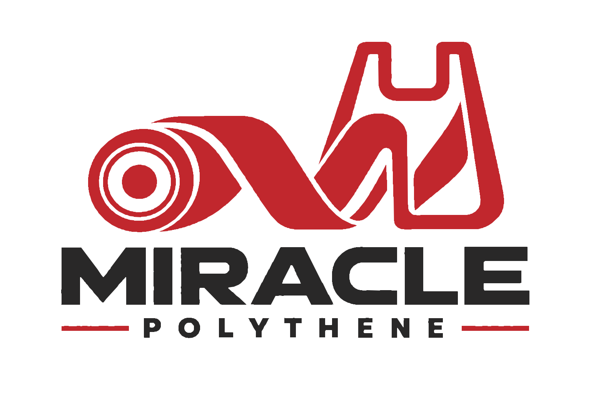

# Miracle Polythene

A marketing website for **Miracle Polythene**, a HDPE/LDPE polythene and
nylon packaging manufacturer. The company produces Yodi nylons, chin-chin
nylons, black/yellow/white market bags, pharmacy and cake bags, and fully
customized packaging — but had no centralized way to show customers what
it makes, how it's made, or how to request a custom specification.

This site is that: a single-page site that explains the HDPE vs LDPE
materials, walks through the film-to-bag conversion process, lists the
product range as a spec index, and gives customers a form to describe the
packaging they need.

## Built with

- **HTML5** and **CSS3** — hand-written, no CSS or JS frameworks/libraries
- A shared set of **design tokens** (`brand.css`) for colour, type and
  spacing, so every section pulls from the same palette (`--color-red`,
  `--color-blue`, `--color-charcoal`, etc.) instead of one-off values
- **Google Fonts** — Space Grotesk (headings) and Work Sans (body)
- A hand-vectorized **SVG logo**, traced from the original artwork and
  verified pixel-for-pixel against it
- Plain product photography, used as real content rather than stock
  imagery (roll close-ups, a custom heart-punched roll as proof of
  customization capability)
- No JavaScript — the mobile nav menu uses the checkbox-hack (a hidden
  `<input type="checkbox">` plus a `<label>`) instead of a script

## Structure

```
index.html            the whole site (markup + embedded CSS)
images/
  miracle-polythene-logo.svg
  rolls-macro.jpg      hero background
  roll-heart.jpg       custom-order section
  rolls-stack.jpg      footer background
```

## Viewing it

Keep `index.html` and `images/` in the same folder, then open
`index.html` in a browser — no build step or server required.
